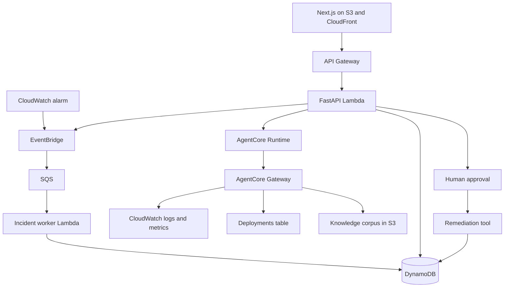

# Architecture



The dashboard is the product surface. Reading an incident does not require the AWS Console.

The same loop, as a sequence:

```text
Detect → Queue → Investigate → Retrieve → Reason → Propose
              → Approve → Act → Observe → Evaluate → Measure cost
```
